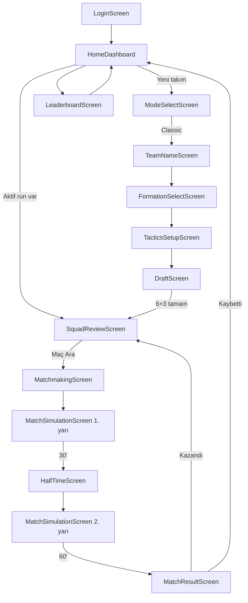

# 6Pas: Draft Arena — MVP Geliştirme Planı

> Bu doküman, 6Pas: Draft Arena web oyununun MVP geliştirme planıdır.
> Kaynak: `6Pas Draft Arena Development Plan` spesifikasyonu.
> Durum: **Onay bekliyor** — onay sonrası kodlamaya geçilecek.

---

## 1. Ürün Özeti

**6Pas: Draft Arena**, 6v6 halısaha hissinde, FIFA Draft mantığından esinlenen, **text-based futbol draft auto-battler** web oyunudur.

- Oyuncu bir kadro draft eder (6 ilk oyuncu + 3 yedek), o kadroyla maç arar.
- Maçlar sahada görsel hareket olmadan, **doğal futbol yayını üslubunda** event log ile anlatılır.
- Kazandıkça puan ve win streak birikir, **aynı kadroyla devam edilir**.
- Kaybedince run biter, kadro gider, yeni takım kurulur (roguelike his).
- Arka planda statlar, perkler, kaptan bonusu, kimya, taktik ve zarlar sonucu belirler — **hiçbir mekanik terim kullanıcıya gösterilmez**.

Temel his: *"Kadromu ben kurdum, taktiği ben seçtim, maçı yayın gibi izliyorum, her galibiyet serimi büyütüyor, tek mağlubiyet her şeyi bitiriyor."*

---

## 2. Final Oyun Döngüsü

1. Oyuna gir (mock login / kullanıcı adı).
2. Aktif run varsa devam et; yoksa yeni takım kur.
3. Takım ismini belirle.
4. Diziliş seç (2-2-1, 1-2-2, 1-3-1, 2-1-2).
5. Varsayılan oyun tarzını seç (Ofansif / Dengeli / Defansif / Kontra).
6. Taktik planını kur (kazanırken / beraberken / kaybederken).
7. Drafta gir: pozisyon slotuna tıkla → o pozisyona uygun 3 adaydan birini seç.
8. İlk seçilen oyuncu **kaptan** olur.
9. İlk 6 + 3 yedek tamamlanınca Squad Review ekranı: kadro, kimya, takım gücü, taktik.
10. "Maç Ara" → 1-3 sn matchmaking → ghost/bot rakip.
11. 60 dakikalık text-based maç: 1. yarı (1'-30') → **devre arası müdahalesi** → 2. yarı (31'-60').
12. Maç sonucu: puan, streak, maçın adamı, kritik an.
13. **Kazandıysan:** aynı kadroyla tekrar maç ara (run devam).
14. **Kaybettiysen:** run "eliminated" olur → yeni takım kurma zorunluluğu.
15. Leaderboard'da yüksel.

---

## 3. MVP Kapsam Kararı

MVP'de **yapılacaklar**:

- Frontend-only web app (backend yok, mock service layer + localStorage)
- Mock login (kullanıcı adı ile giriş)
- Classic Mode (Ranked & Tournament "Coming Soon" görünür)
- Takım ismi belirleme (+ rastgele isim önerici)
- Diziliş seçimi (4 diziliş)
- Oyun tarzı + taktik plan seçimi
- 6 ilk oyuncu + 3 yedek draft sistemi (slot → pozisyona özel 3 aday)
- Kaptan sistemi (ilk seçim, değiştirilemez)
- Rarity sistemi (6 seviye) + Icon oyuncular (fake isimli)
- Oyuncularda fake kulüp, fake lig, gerçek uyruk
- Basit kimya sistemi (0-100, kulüp/lig/uyruk/kaptan bağları)
- Squad Review ekranı
- Matchmaking ekranı + ghost/bot rakip (otomatik draft)
- 60 dakikalık text-based maç simülasyonu
- Devre arası taktik müdahale + basit oyuncu değişikliği (aynı pozisyon, maks 2)
- Doğal maç anlatımı (mekanik terim sızdırmayan narration engine)
- Arka planda d20 zar + perk çözümleme
- Gerçekçi skor dengesi (çoğunlukla 0-0 … 3-1 bandı)
- Puan + streak sistemi
- Kaybedince run reset
- Basit Classic leaderboard (lokal)

## 4. MVP Dışında Bırakılanlar

- Gerçek online matchmaking, gerçek zamanlı PvP
- Ranked (MMR/Elo), Tournament (bracket)
- Chat, arkadaş daveti, oda kurma
- Sezon sistemi, transfer pazarı, oyuncu geliştirme
- Sakatlık sistemi
- 2D/3D saha animasyonu
- Gerçek futbolcu/kulüp isimleri
- Hava koşullarının aktif etkisi (mimaride `WeatherModifier` alanı hazır bırakılır)

---

## 5. Teknik Mimari ve Stack

| Katman | Seçim | Gerekçe |
|---|---|---|
| Build | **Vite + React 18 + TypeScript** | Hızlı geliştirme, spesifikasyondaki `.tsx/.ts` yapısıyla birebir uyum |
| State | **Zustand** (`useGameStore`, `useUserStore`) | Basit, ölçeklenebilir, boilerplate'siz |
| Stil | **Tailwind CSS** + küçük tema token seti | Hızlı UI, koyu/açık tema ve rarity renkleri token'larla yönetilir |
| Navigasyon | Ekran state-machine (store içinde `currentScreen`) | Oyun akışı korumalı geçişler gerektirir; ileride URL router'a taşınabilir |
| Kalıcılık | `localStorage` üstünde **async service layer** | Bugün mock, yarın gerçek backend — servis imzaları değişmeden |
| RNG | Seed'lenebilir PRNG (`utils/random.ts`) | Tekrarlanabilir maçlar → debug ve denge testi |
| i18n | Sözlük tabanlı `t()` katmanı (UI) + locale-keyed anlatım şablon bankası | MVP Türkçe; İngilizce eklemek yalnızca yeni sözlük/şablon dosyası demek |
| Test | Vitest (engine katmanı) + toplu simülasyon scripti | Skor dağılımı 1000 maçlık simülasyonla doğrulanır |

**Mimari ilkeler (spesifikasyondan):**
- Her şey `App.tsx` içine yığılmaz; game logic / UI / data / service katmanları ayrı.
- Engine'ler saf fonksiyon (UI'dan bağımsız, test edilebilir).
- Service layer async imzalı — mock'tan gerçek backend'e geçiş kod değişikliği gerektirmez.
- `hiddenDiceRolls`, `hiddenPerksTriggered` debug için tutulur, UI'da asla gösterilmez.

---

## 6. Ekran Akışı



Kural: Her geçiş store'daki run durumuna göre korunur (ör. kadro tamamlanmadan Squad Review'a geçilemez, aktif maç varken draft açılamaz).

---

## 7. Run Sistemi

Oyun tek kadroyla seri yapma (run) mantığında çalışır.

**Run alanları:** `id, userId, teamName, mode, formationId, defaultPlayStyle, tacticalPlan, squad, bench, captainId, chemistry, wins, losses, streak, pointsEarned, status, createdAt, updatedAt`

**Kurallar:**
- Aynı anda **tek aktif run** olabilir.
- Galibiyet → aynı run devam eder (`wins++`, `streak++`, puan eklenir).
- Mağlubiyet → `status: eliminated`, run kapanır, istatistikler kullanıcı profiline işlenir.
- Yeni run ancak aktif run yokken (veya elenince) açılabilir.
- Run durumu her adımda localStorage'a yazılır → sayfa yenilense bile devam edilir.

---

## 8. Draft Sistemi

Akış:

1. Takım ismi → diziliş → oyun tarzı + taktik plan → draft ekranı.
2. Dizilişe göre boş ilk 6 slotu (1 GK + dizilişin DEF/MID/ATK dağılımı) + 3 yedek slotu görünür.
3. Kullanıcı bir slota tıklar → sistem **sadece o pozisyona uygun** 3 aday getirir.
4. Adaylardan biri seçilir, slota yerleşir. **İlk seçilen oyuncu otomatik kaptan.**
5. İlk 6 bitince yedek seçimi: kullanıcı yedek slotuna tıklarken pozisyon seçer (ATK/MID/DEF), o pozisyondan 3 aday gelir.
6. Kadro tamamlanınca Squad Review.

**Aday üretimi (`generateDraftCandidates`):**
- Rarity, ağırlık tablosundan çekilir (bkz. §13), sonra o pozisyon + rarity havuzundan rastgele oyuncu seçilir.
- Aynı draft içinde daha önce seçilen veya o an aday olarak gösterilen oyuncu tekrar gelmez (tekillik garantisi).
- Havuz yetersizse rarity bir alt seviyeye düşerek doldurulur (fallback).

**MVP kararları:**
- Yedek kaleci zorunlu değil; 3 yedek saha oyuncusudur. Model, ileride yedek GK eklenebilecek şekilde esnek (bench slotu pozisyon alanı taşır).
- Adaylar arasından seçim zorunludur; "pas geçme / yeniden çevirme" MVP'de yok.

## 9. 6 Oyuncu + 3 Yedek Sistemi

- Takım toplam **9 oyuncu**: sahada 1 GK + 5 saha oyuncusu, kulübede 3 yedek.
- Saha oyuncusu pozisyonları: **ATK / MID / DEF**; kaleci ayrı pozisyon (**GK**).
- Her takım sahada minimum 1 GK, 1 ATK, 1 MID, 1 DEF bulundurur (dizilişler bunu zaten garanti eder).
- Dizilişler 5 saha oyuncusuna göre çalışır:

| Diziliş | DEF | MID | ATK | Karakter |
|---|---|---|---|---|
| 2-2-1 | 2 | 2 | 1 | Dengeli, güvenli |
| 1-2-2 | 1 | 2 | 2 | Hücum ağırlıklı, riskli |
| 1-3-1 | 1 | 3 | 1 | Orta saha kontrolü, kimya/pas oyunu |
| 2-1-2 | 2 | 1 | 2 | Kontra dostu, orta saha zayıf |

- Diziliş objesi: `id, name, defSlots, midSlots, atkSlots, description, playStyleAffinity` (affinity: dizilişle uyumlu oyun tarzına küçük gizli bonus, ör. 2-1-2 + Kontra).

---

## 10. Taktik Sistemi

**Oyun tarzları ve gizli etkileri** (değerler denge turunda kalibre edilecek başlangıç önerileridir):

| Tarz | Pozisyon üretimi | Atak | Defans | Kaleci | Not |
|---|---|---|---|---|---|
| Ofansif | +%25 | +2 | -2 | — | Açık verme riski: rakip kontra event şansı ↑ |
| Dengeli | — | — | — | — | MID duellolarına +1, kimya etkisini stabilize eder |
| Defansif | -%20 | -1 | +2 | +1 | Rakip şut kalitesine -1 |
| Kontra | -%10 | — | +1 | — | Rakip Ofansif ise: kontra event şansı ↑↑ ve kontra ataklarda +2 |

**Taktik Plan (`TacticalPlan`):** `whenWinning / whenDrawing / whenLosing` — her biri 4 tarzdan biri.

- Maç sırasında **aktif taktik skora göre otomatik değişir**: öndeyken `whenWinning`, eşitken `whenDrawing`, gerideyken `whenLosing`.
- Devre arasında hem varsayılan tarz hem plan güncellenebilir.
- Bonuslar `applyTacticModifiers()` ile duel skorlarına eklenir; kullanıcı yalnızca anlatımdaki oyun karakterinden hisseder.

## 11. Devre Arası Müdahale Sistemi

30. dakikada maç durur, **HalfTimeScreen** açılır:

- İlk yarı skoru + 2-3 cümlelik doğal ilk yarı özeti (`generateHalfTimeSummary`).
- Oyun tarzı değiştirilebilir.
- Taktik planı (3 durum) güncellenebilir.
- **Oyuncu değişikliği:** maks 2; MVP'de **yalnızca aynı pozisyon** içinde (ATK↔ATK vb.). Çıkan oyuncu geri giremez.
- Değişiklik sonrası kimya, sahadaki 6 üzerinden **yeniden hesaplanır**.
- "İkinci Yarıya Başla" → 2. yarı eventleri güncel modifier'larla üretilir.

Ekran kısa ve temiz: tek kart, akışı bozmaz.

---

## 12. Kaptan Sistemi

- İlk draft seçimi kaptandır, **değiştirilemez** — ilk seçim stratejik önem taşır.
- **Gizli etkiler:**
  - Kaptanın dahil olduğu, pozisyonuyla ilgili önemli anlarda (şut, kilit pas, kritik müdahale, kurtarış) +1 gizli zar bonusu.
  - Kaptanın ana perki (perk listesindeki ilk perki) %25 daha yüksek tetiklenme ihtimaline sahip.
  - Kimyaya kaptan bağları üzerinden katkı (bkz. §13).
- **UI'da asla sayı gösterilmez.** Kaptan kartında doğal metin: *"Büyük anlarda sorumluluk alır."*, *"Takımın hücum ritmini yukarı çeker."*, *"Savunma hattını toparlar."* (pozisyona göre `captainTrait`).
- Icon kaptan özel hissettirir (rozet + flavor) ama otomatik galibiyet vermez.

## 13. Kimya Sistemi

0-100 arası takım kimyası; **sahadaki 6 oyuncu** üzerinden hesaplanır (yedekler girince yeniden hesap).

**Formül (başlangıç değerleri):**
- Başlangıç: **50**
- Aynı **kulüp** çifti: **+8**
- Aynı **lig** çifti: **+3**
- Aynı **uyruk** çifti: **+3**
- Kaptanla aynı ligden her oyuncu: **+2**
- Kaptanla aynı uyruktan her oyuncu: **+2**
- Sonuç 0-100'e sıkıştırılır.

**Katmanlar ve gizli etki:**

| Skor | Etiket | Gizli modifier |
|---|---|---|
| 0-39 | Kopuk takım | -2 (pas/savunma duellolarında), top kaybı eventi şansı ↑ |
| 40-59 | Normal | 0 |
| 60-79 | Uyumlu | +1 |
| 80-100 | Çok uyumlu | +2, pozisyon üretimi +%10 |

- Kimya gol garantisi vermez; Icon oyuncu düşük kimyalı takımı tek başına taşıyamaz.
- **UI'da net gösterim:** `Takım Kimyası: 72 / 100 — "Uyumlu"` + kaynak listesi (ör. *"3 oyuncu aynı ligden"*, *"Kaptanla 2 oyuncu aynı ligden"*).

## 14. Rarity / Icon Sistemi

| Rarity | Türkçe UI | OVR | Perk | Draft ağırlığı |
|---|---|---|---|---|
| Common | Sıradan | 55-65 | 0-1 | %35 |
| Solid | Sağlam | 63-72 | 0-1 | %25 |
| Pro | Profesyonel | 70-79 | 1-2 | %20 |
| Star | Yıldız | 78-86 | 2-3 | %12 |
| Legend | Efsane | 85-91 | 3-4 | %6 |
| Icon | İkon | 90-96 | 3-4 | %2 |

**Icon sistemi:**
- Gerçek isim yok; esinlenilen yıldız hissedilir: *Lio Messan, Cristian Rovaldo, Kyl Mbari, Erhan Haalandar, Zizo Zidani, Diego Maradova, Johan Cruyven, Peleiro, Luka Modricci, Kevin De Bruyneer, Robert Lewanovski, Mo Saladin, Karim Benzari, Andres Iniestro, Xavi Hernan, Jude Bellinger, Luis Suarezo, Harry Kayn, Gigi Buffoni, Iker Casillaso, Lev Yasharin…*
- Türk esintili: *Arta Güleran, Hakan Çalhan, Ferdi Kadırov, Kerem Aktürko, Cenk Tosuni, Emre Moratti, İrfan Kahveciro…*
- `inspiredBy` alanı veri setinde tutulur, **UI'da gösterilmez**.
- Icon kart UI'sı: ICON rozeti, parlak border, hafif glow, özel flavor text. Ağır animasyon yok.

**Oyuncu havuzu (MVP hedefi):** ~240 oyuncu — 65 ATK, 65 MID, 65 DEF, 45 GK; rarity dağılımı draft ağırlıklarına paralel; ~28 Icon. Fake kulüpler (Istanbul Falcons, Madrid Crown, Milano Vesta, Manchester Forge, Paris Étoile, Munich Adler…), fake ligler (Turkish Premier Circuit, Iberian Crown League, English Metro League…), gerçek uyruklar.

## 15. Perk Sistemi

- Oyuncu başına 0-4 perk; bazı oyuncular perksiz (yüksek stat + perksiz = güvenilir profil).
- Perkler **pozisyona özgü**; isimler spesifikasyondaki kaliteli ton: ATK (*Bilek Kıran, Ölü Köşe, Dar Açı Ustası, Rövaşata Tehdidi…*), MID (*İğne Deliği, Tempo Hırsızı, Pres Kıran, Sessiz Orkestra…*), DEF (*Son Perde, Çizgi Süpürücü, Alan Kilidi, Son Adam…*), GK (*Son Nefes Refleksi, Açı Katili, Uçan Eldiven, Panik Yok…*).
- Perk objesi: `id, name, positionType, description, triggerEvents, bonusType, bonusValue, counters, rarityWeight, narrationHints`.
  - `triggerEvents`: hangi event tiplerinde devreye girer (ör. Ölü Köşe → uzaktan şut, plase).
  - `counters`: karşı perk etkileşimi (ör. Şut Söndüren, Bilek Kıran'ın bonusunu kısmen nötralize eder).
  - `narrationHints`: anlatım motoruna perk'e uygun cümle kalıbı seçtiren ipuçları.
- Perkler oyuncu kartında **gösterilir**; maç anlatımında **asla isimle geçmez**, etkisi cümleye yedirilir (bkz. §17).

---

## 16. Gizli Zar ve Gizli Perk Çözümleme Sistemi

Tüm hesap arka planda; kullanıcı yalnızca futbol anlatımı görür.

**Skorlar:**

```
AttackScore     = ilgili stat + perk bonusu + kaptan bonusu + aktif taktik bonusu + kimya modifier + d20
DefenseScore    = ilgili stat + perk bonusu + kaptan bonusu + aktif taktik bonusu + kimya modifier + d20
GoalkeeperScore = kaleci statı + perk bonusu + kaptan bonusu + kimya modifier + d20
```

- Stat 55-96 bandında, d20 1-20 → statlar belirleyici ama zar sürprize yer bırakır: Icon kötü zarla kaçırabilir, Common iyi zarla sürpriz yapabilir.
- **Duel çözümü (`resolveDuel`):** atak hamlesi önce savunmayla karşılaşır; atak farkla kazanırsa şut kalitesi artar; ardından şut vs kaleci (`resolveShot` → `resolveGoalkeeperSave`). Eşik örneği: fark ≥ +6 net pozisyon, +1…+5 zor pozisyon, ≤ 0 savunma kazanır.
- **Kritikler:** d20'de 19-20 küçük ekstra (nadir akrobatik anlar burada doğar), 1-2 beklenmedik hata.
- **Perk tetikleme (`resolveHiddenPerkInteraction`):** event tipi perkin `triggerEvents` listesindeyse temel %35 tetiklenme (kaptan ana perki %60'a yakın); tetiklenen perk `bonusValue` ekler, karşı tarafta `counters` eşleşmesi varsa etki kırpılır. Tetiklenmeler `hiddenPerksTriggered`'a loglanır, UI'a çıkmaz.
- Stat kullanım matrisi: şut → ATK, ara pas/oyun kurma → MID, müdahale/blok → DEF; kalecide yakın mesafe → REF, hava topu/korner → COMMAND, kontra başlatma → DISTRIBUTION.

## 17. Doğal Maç Anlatımı Sistemi

**Altın kural:** Mekanik hiçbir terim ("perk aktif oldu", "zar", "+5 bonus", "attack score") anlatımda geçmez.

**Narration engine (`narrationEngine.ts`):**
- Event tipi + sonuç + katılan oyuncular + perk `narrationHints` → şablon bankasından cümle dizisi üretir.
- **Gerilim yapısı:** her önemli an 3-5 satırda açılır: hazırlık → hamle → gerilim satırı → sonuç.

> "18' London Borough hızlı çıktı. Morel tek pasla oyunun yönünü değiştirdi."
> "Mbari savunmanın arkasına sarktı, topu önüne aldı."
> "Kaleciyle karşı karşıya…"
> "Vuruşunu yaptı."
> "Top uzak köşeye süzülüyor…"
> "GOOOL! London Borough 1-0 öne geçiyor."

- **Perk yedirme örneği:** Bilek Kıran tetiklendiğinde → *"Dar alanda savunmacıyı üstüne çekti, bileğini son anda çevirip önünü boşalttı."*
- **Tekrar koruması:** aynı şablon aynı maçta tekrar kullanılmaz; her event tipi için ≥6 varyant yazılır.
- Şablonlar slot'ludur: `{oyuncu}`, `{takım}`, `{dakika}`, `{skor}`. Ton: doğal Türkçe futbol yayını.
- Şablon bankası **locale-keyed** tutulur (`tr` MVP'de tek locale); ileride İngilizce anlatım, motor koduna dokunmadan yeni şablon dosyasıyla eklenir.
- Akrobatik anlar (rövaşata, rabona) yalnızca ilgili perk + yüksek zar kombinasyonunda, maç başına 0-2 kez → nadir ve özel hissettirir.

## 18. Maç Simülasyon Sistemi

- 60 dakika: 1. yarı 1'-30', devre arası, 2. yarı 31'-60'.
- **Event bütçesi:** maç başına 7-12 önemli an (yarı başına 4-6), 3-7 şut, 0-4 gol, 1-4 gizli perk etkileşimi, 0-2 akrobatik an. Önemli anlar arasında dakika atlanır; 55'+ "son dakika atağı" şansı ayrıca vardır.
- **Hücum sahipliği:** her eventin hangi takıma ait olacağı, MID gücü + aktif taktik + kimya karşılaştırmasından türeyen ağırlıkla belirlenir.
- **Akış:** 1. yarı eventleri üretilir → UI'da satır satır gösterilir → 30'da otomatik devre arası → müdahale sonrası 2. yarı **güncel modifier'larla** üretilir → 60' final düdüğü.
- Şut anında sonuç hemen verilmez; hazırlık → şut → gerilim → sonuç satırları sırayla akar (bkz. §17).
- Maç bitince `pickManOfTheMatch()` (en etkili event katılımcısı) ve "kritik an" seçilir.
- **Skor dengesi hedefi:** tipik skorlar 0-0, 1-0, 1-1, 2-1, 2-0, 3-1; nadir 3-2/4-2/4-3; çok nadir 5-3. 6-5, 7-4 asla. Doğrulama: 1000 maçlık otomatik simülasyonla gol dağılımı raporu (denge fazının çıktısı).
- `WeatherModifier` alanı maç bağlamında tanımlı ama MVP'de nötr (ileride hava koşulları buraya bağlanır).

## 19. Matchmaking MVP Yaklaşımı

- Oda sistemi yok; tek buton: **"Maç Ara"**.
- "Rakip aranıyor…" ekranı 1-3 sn gösterilir → **ghost rakip** atanır.
- **Ghost üretimi (`generateGhostOpponent`):** rakip takım, oyuncuyla aynı draft kurallarıyla otomatik kurulur (diziliş + tarz + taktik plan + 9 oyuncu + kaptan + kimya). Fake takım isim havuzundan isim alır.
- **Güç eşleme:** `calculateTeamPower` (OVR ortalaması + kimya/10 + Icon katkısı) → ghost, oyuncu gücünün ±5 bandında üretilir. Bilinçli hafif sapmalar "underdog win" bonusunu mümkün kılar.
- Kod, ileride gerçek `matchmakingQueue` servisine bağlanabilecek arayüzle yazılır (`findMatchForRun(run): Promise<Opponent>` — bugün ghost döner, yarın kuyruk).

---

## 20. Puan / Streak Sistemi

- Base win: **100 puan**
- Streak bonusu: 1. galibiyet +0, 2. +25, 3. +50, 4. +75, **5+ galibiyet +100**
- Ek bonuslar: Clean sheet **+20** · 3+ gol **+20** · Underdog win **+30** (takım gücü rakipten belirgin düşükken kazanma) · Icon kaptana karşı kazanma **+25**
- Puanlar run'a ve kullanıcı toplamına işlenir; formül `scoringEngine` içinde genişletilebilir tutulur (yeni bonus eklemek tek satırlık tanım olmalı).
- Mağlubiyet puan silmez; run'ı bitirir.

## 21. Leaderboard Sistemi

- MVP: **lokal Classic leaderboard** (mock service + localStorage; gerçek backend'e hazır arayüz).
- Alanlar: `userId, username, totalPoints, bestStreak, totalWins, totalLosses, matchesPlayed, currentActiveRunId`.
- Sıralama: `totalPoints` → eşitlikte `bestStreak` → `totalWins`.
- MVP'de tabloyu doldurmak için üretilmiş bot profilleri gösterilir (oyuncunun sırası anlamlı hissettirir).
- Gelecekte Ranked leaderboard'u (MMR/Elo) aynı servis arayüzüne ikinci tablo olarak eklenir.

---

## 22. Data Model

**User:** `id, username, totalPoints, bestStreak, classicWins, classicLosses, rankedRating?, createdAt`

**Run:** `id, userId, mode, teamName, formationId, defaultPlayStyle, tacticalPlan, squad, bench, captainId, chemistry, wins, losses, streak, pointsEarned, status(active|eliminated|completed), createdAt, updatedAt`

**Player (saha):** `id, name, position(ATK|MID|DEF), rarity, ovr, atk, mid, def, nationality, league, club, perks[], isIcon, flavorText, inspiredBy?(UI'da gizli), captainTrait?`

**Goalkeeper:** `id, name, position(GK), rarity, ovr, ref, command, distribution, nationality, league, club, perks[], isIcon, flavorText, inspiredBy?, captainTrait?`

**Perk:** `id, name, positionType, description, triggerEvents[], bonusType, bonusValue, counters[], rarityWeight, narrationHints[]`

**Formation:** `id, name, defSlots, midSlots, atkSlots, description, playStyleAffinity`

**TacticalPlan:** `whenWinning, whenDrawing, whenLosing` (her biri: Ofansif|Dengeli|Defansif|Kontra)

**Chemistry:** `score, tier, leagueLinks, nationLinks, clubLinks, captainLinks, description`

**Match:** `id, mode, homeRunId, awayRunId, homeTeam, awayTeam, events[], halftimeState, finalScore, winner, pointsAwarded, createdAt`

**MatchEvent:** `minute, half, type, attackingTeam, defendingTeam, playersInvolved[], hiddenPerksTriggered[], hiddenDiceRolls[], textLines[], result, scoreAfterEvent`
— `hidden*` alanları yalnızca debug; UI'da gösterilmez.

Stat anlamları: **OVR** genel güç · **ATK** şut/bitiricilik/çalım · **MID** pas/oyun kurma/tempo · **DEF** müdahale/blok/kademe · **REF** refleks/karşı karşıya · **COMMAND** hava topu/ceza sahası hakimiyeti · **DISTRIBUTION** dağıtım/kontra başlatma.

## 23. Component Mimarisi

```
App
└─ Router (ekran state-machine)
   ├─ LoginScreen
   ├─ HomeDashboard
   ├─ ModeSelectScreen
   ├─ TeamNameScreen
   ├─ FormationSelectScreen
   ├─ TacticsSetupScreen
   ├─ DraftScreen
   │  ├─ PositionSlot · BenchSlot
   │  ├─ CandidateCards → PlayerCard (RarityBadge, CaptainBadge, IconBadge, PerkBadge)
   │  └─ ChemistryPanel
   ├─ SquadReviewScreen (TeamPanel, ChemistryPanel)
   ├─ MatchmakingScreen
   ├─ MatchSimulationScreen (Scoreboard, EventLog)
   ├─ HalfTimeScreen (TacticalPlanEditor, SubstitutionPanel)
   ├─ MatchResultScreen
   └─ LeaderboardScreen
```

Ortak parçalar (`PlayerCard`, rozetler, `ChemistryPanel`, `TeamPanel`) tüm ekranlarda yeniden kullanılır.

## 24. Dosya Yapısı

```
src/
├─ app/                    # App, Router, tema
├─ components/             # Ortak UI (PlayerCard, rozetler, paneller)
├─ screens/                # 13 ekran
├─ data/
│  ├─ players.ts  goalkeepers.ts  perks.ts  formations.ts
│  ├─ clubs.ts  leagues.ts  nationalities.ts  teams.ts   # fake takım isimleri
├─ game/
│  ├─ draftEngine.ts  rarityEngine.ts  chemistryEngine.ts
│  ├─ matchEngine.ts  narrationEngine.ts  tacticsEngine.ts  halftimeEngine.ts
│  ├─ matchmakingEngine.ts  scoringEngine.ts  leaderboardEngine.ts
│  └─ weatherEngine.ts     # MVP'de nötr iskelet
├─ store/                  # useGameStore.ts, useUserStore.ts
├─ services/               # authService, runService, matchmakingService, leaderboardService
├─ i18n/                   # sözlükler (tr.ts) + t() yardımcı katmanı
├─ types/                  # index.ts (tüm modeller)
└─ utils/                  # random.ts (seedli), weightedRandom.ts, formatters.ts
```

Önemli fonksiyonlar spesifikasyondaki listeyle birebir: `generateDraftCandidates, getWeightedRandomRarity, assignCaptainIfFirstPick, validateSquadByFormation, calculateTeamChemistry, createNewRun, eliminateRun, findMatchForRun, generateGhostOpponent, getActiveTacticByScoreState, generateHalfTimeSummary, applySubstitution, generateMatchEvents, resolveDuel, resolveShot, resolveGoalkeeperSave, pickManOfTheMatch, generateNaturalEventText, generateAttackNarration, generateGoalText, updateLeaderboardAfterMatch…`

---

## 25. Geliştirme Sırası

| Faz | Kapsam | Çıktı |
|---|---|---|
| **0. İskelet** | Vite+React+TS+Tailwind kurulumu, tipler, tema token'ları, ekran state-machine, boş ekranlar | Ekranlar arası gezilebilir iskelet |
| **1. Veri** | Perkler, dizilişler, kulüp/lig/uyruk, ~240 oyuncu havuzu (Icon'lar dahil) | Zengin, denetlenebilir veri seti |
| **2. Draft çekirdeği** | rarityEngine, draftEngine, chemistryEngine + Draft/SquadReview UI, kaptan | Uçtan uca kadro kurma |
| **3. Maç motoru** | matchEngine, tacticsEngine, narrationEngine, matchmaking (ghost) | Konsolda tam maç simülasyonu (UI'sız test edilebilir) |
| **4. Maç UI** | MatchSimulation, HalfTime (taktik + değişiklik), MatchResult | Uçtan uca oynanabilir maç |
| **5. Run & meta** | runService, scoringEngine, leaderboard, HomeDashboard bağlanması, localStorage kalıcılık | Tam oyun döngüsü |
| **6. Denge & cila** | 1000 maçlık simülasyon raporu, skor/kimya/perk kalibrasyonu, Icon görsel cilası, anlatım varyant genişletme | Yayınlanabilir MVP |

Her faz sonunda çalışan bir dikey dilim olur; faz 3'ün motoru UI'dan bağımsız test edilir.

## 26. Denge Riskleri

| Risk | Belirti | Önlem |
|---|---|---|
| Icon dominasyonu | Icon çeken hep kazanıyor | d20 payı yüksek tutulur; düşük kimya Icon'u frenler; ghost güç eşleme Icon'u da sayar |
| Skor enflasyonu | 5-4, 6-3 skorlar | Şut→gol dönüşümü kaleci lehine kalibre; event bütçesi sınırlı; 1000 maç simülasyonuyla doğrulama |
| Ofansif meta | Herkes hep Ofansif | Kontra'nın Ofansif'i cezalandırması; Ofansif'in savunma zafiyeti gerçek olmalı |
| Kimya stacking | Tek lig kadrosu zorunlu hissettirir | Kimya modifier'ı küçük (maks ±2); çeşitlilik draftı zaten zorlar |
| Streak snowball | Liderler erişilemez | Streak bonusu +100'de tavan; run her mağlubiyette sıfırlanıyor (doğal fren) |
| Anlatım tekrarı | Aynı cümleler sıkar | Event tipi başına ≥6 varyant, maç içi tekrar koruması, faz 6'da banka genişletme |
| Devre arası önemsizliği | Kimse müdahale etmiyor | 2. yarı eventleri müdahale sonrası üretilir → taktik değişikliği gerçekten hissedilir |

## 27. Gelecek: Ranked, Tournament, Weather

- **Ranked:** `User.rankedRating` alanı gün 1'den modelde. Eklenecekler: Elo güncelleme fonksiyonu (`scoringEngine`'e), rating bazlı ghost/gerçek eşleme (`matchmakingService`'e) ve ikinci leaderboard tablosu. Ekranlar hazır (ModeSelect'te "Coming Soon" kilidi kalkar).
- **Tournament:** Mevcut maç motoru değişmeden, üstüne 4/8 kişilik bracket state-machine'i kurulur (`tournamentEngine`); her tur bir `Match` üretir; özel ödül/leaderboard aynı servis desenini izler.
- **Weather:** Maç bağlamındaki `WeatherModifier` MVP'de nötrdür. Aktif edildiğinde pas isabeti, şut kontrolü, kaleci hatası, uzaktan şut ve kimya üzerine ek modifier'lar tek noktadan (duel skor hesabı) devreye girer; anlatım motoru hava temalı şablon setini açar.

---

## 28. Görsel Tasarım Kararları (kararlaştırıldı)

### Tema: Retro Futbol Gazetesi 🗞️

Oyun, eski bir spor gazetesinin sayfaları gibi hissettirir — text-based anlatım kimliğiyle birebir örtüşür.

- **Palet:** gazete kağıdı kremi zemin (`#F4EDDE` bandı), mürekkep koyusu metin (`#211C16` bandı), çim yeşili birincil vurgu, vintage kırmızı-turuncu ikincil vurgu (GOL manşetleri, kritik anlar), hardal/altın rozet tonu.
- **Doku ve detay:** ince kağıt dokusu, çift çizgili gazete cetvelleri, manşet blokları, "spot ilan" çerçeveli kartlar. Skorboard eski tip mekanik pano estetiği.
- **Maç anlatımı:** canlı maç sayfası "muhabir bildiriyor" sütunu gibi akar; GOOOL satırları manşet puntosuyla basılır.
- **Rarity dili (neon glow yerine mürekkep/folyo):** Common gri mürekkep · Solid bronz · Pro mavi mürekkep · Star bordo · Legend altın çerçeve · **Icon: altın folyo + çift çerçeve + "İKON" manşet rozeti** — parlaklık, kâğıt üstünde varak baskı hissiyle verilir.
- Koyu tema MVP'de yok; "gece baskısı" varyantı ileride eklenebilir.

### Tipografi: Karışım

- **Manşet/başlıklar:** serif display (gazete manşeti karakteri).
- **Skor, dakika, istatistik:** condensed/tabular rakamlar (mekanik skorboard hissi).
- **Anlatım metni ve UI gövdesi:** okunaklı modern sans-serif (uzun anlatım metinlerinde konfor öncelikli).
- Fontlar self-host edilir (harici CDN bağımlılığı yok).

### Maç akışı: Hibrit (online-uyumlu)

Satırlar otomatik akar (yayın hissi), hız seçici (1x/2x) + duraklat vardır; şut anlarında akış otomatik yavaşlayıp gerilim kurar.

**Online'da hız kontrolü sorun olmaz, çünkü:** maç bir auto-battler — sonuç ve tüm event timeline'ı maç başında (ve devre arası müdahalelerinden sonra 2. yarı için) motor tarafından **önceden üretilir**. Ekranda gördüğün akış, bitmiş bir kaydın "yayın tekrarı"dır; hız/duraklat tamamen sunum katmanıdır, sonucu etkilemez. Bu yüzden gerçek PvP geldiğinde bile her oyuncu aynı maçı kendi hızında izleyebilir. Tek senkron noktası devre arasıdır: iki taraf da kararını verince (veya ör. 30 sn'lik süre dolunca) 2. yarı üretilir — "iki takım da soyunma odasında" bekleme ekranı. MVP'de rakip bot olduğu için bu bekleme zaten yoktur.

### Dil: Türkçe + i18n altyapısı

- Tüm UI metinleri baştan sözlük dosyalarında (`i18n/tr.ts`), bileşenler `t()` üzerinden okur.
- Anlatım şablon bankası locale-keyed; MVP'de yalnızca `tr` doldurulur.
- Rarity adları dahil UI dili Türkçe (Sıradan → İkon).
